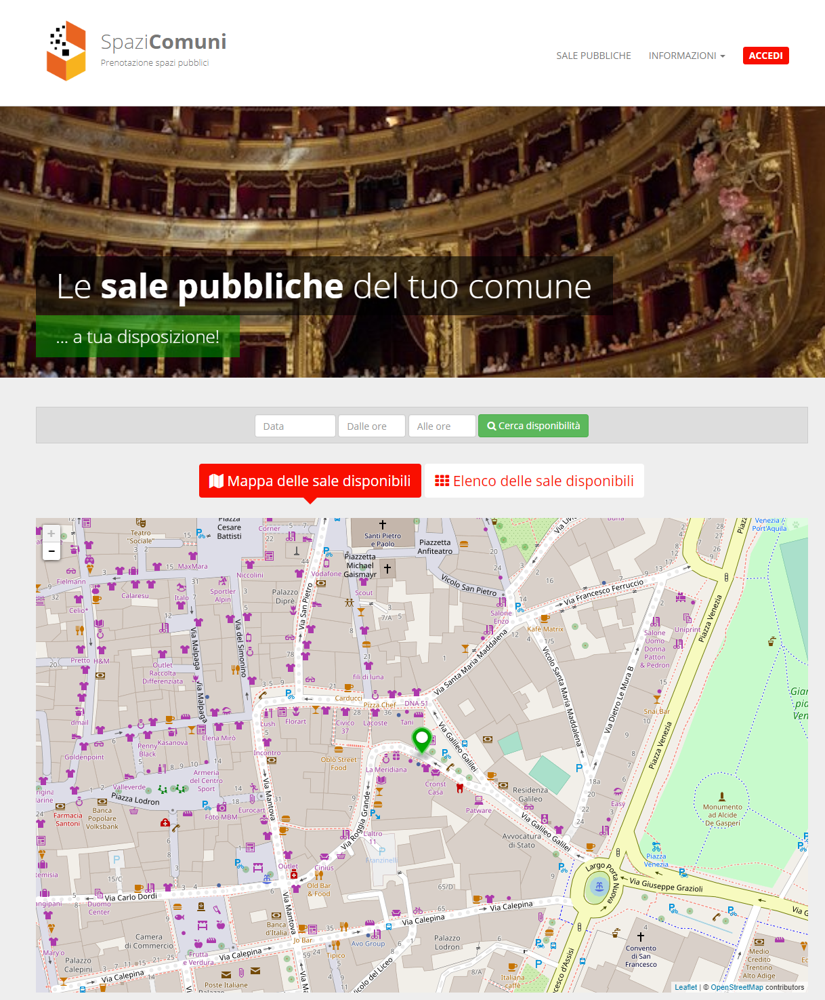

.. _h766e223b2e196b6445512714457612d:

Manuale SpaziComuni
*******************

\ |LINK1|\  è un \ |STYLE0|\  di \ |STYLE1|\  (basato sulla piattaforma Open Source eZ Publish) orientato alla strutturazione dei dati. 

Permette alle \ |STYLE2|\  di esporre sul web le strutture disponibili ai cittadini e alle associazioni che, a loro volta, possono procedere alla prenotazione in modo semplice: 

* il calendario della disponibilità è pubblico e facilmente consultabile on-line

* la prenotazione richiede un semplice login

* il pagamento è gestito ed integrato nel componente 

* l’iter è monitorabile in tempo reale

L’amministratore sa in qualsiasi momento quali sale sono prenotate, quali invece sono libere.

\ |IMG1|\ 

.. toctree:: 

    
        come-funziona.rst
        manuale-amministratore.rst
        manuale-operatori.rst
        manuale-cittadini.rst
    
    
    

.. bottom of content

.. |STYLE0| replace:: **sistema di prenotazione on-line**

.. |STYLE1| replace:: **sale, strutture e attrezzature pubbliche**

.. |STYLE2| replace:: **amministrazioni pubbliche**

.. |LINK1| raw:: html

    <a href="https://www.opencontent.it/Per-la-PA/SpaziComuni" target="_blank">SpaziComuni</a>

