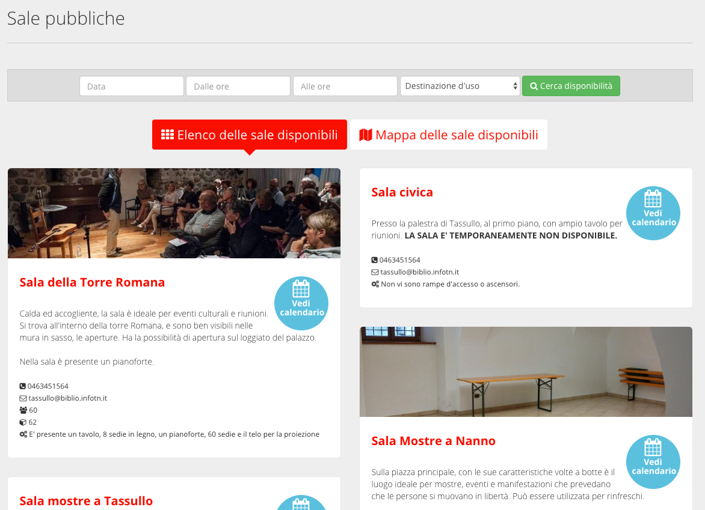
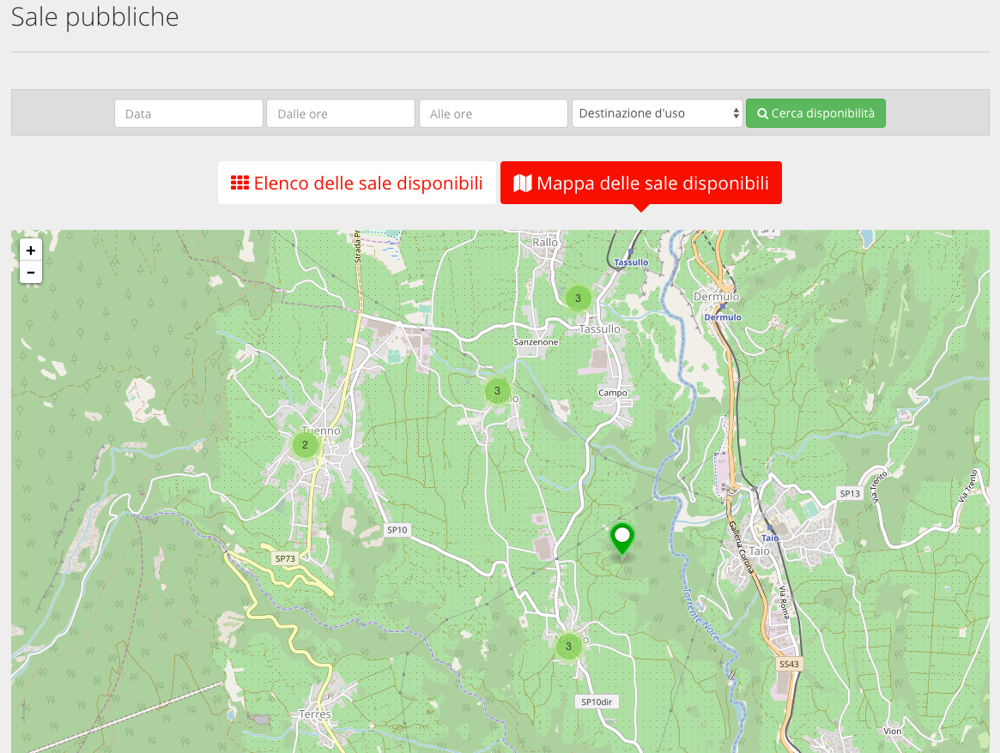

.. _h766e223b2e196b6445512714457612d:

Manuale SpaziComuni
*******************

SpaziComuni è un sistema di prenotazione on-line di sale, strutture e attrezzature pubbliche (basato sulla piattaforma Open Source eZ Publish) orientato alla strutturazione dei dati. 

Permette alle \ |STYLE0|\  di esporre sul web le strutture disponibili alla cittadinanza e alle associazioni, che a loro volta possono procedere alla prenotazione in modo semplice: il calendario della disponibilità è pubblico e facilmente consultabile on-line; la prenotazione richiede un semplice login; il pagamento è gestito ed integrato nel componente; l’iter è monitorabile in tempo reale.

L’amministratore sa in qualsiasi momento quali sale sono prenotate, quali invece sono libere.

.. _h59626249a40664f615e03447347d68:

Esempio tipico di funzionamento
===============================

Gli utenti interni del Comune inseriscono nel sistema i dati relativi a spazi e attrezzature di cui sono responsabili. Tali dati variano a seconda che si tratti di sale o attrezzature, ma ad esempio possono riguardare le dimensioni, il numero di posti, la localizzazione, e i costi.

Il cittadino interessato trova l’elenco delle sale e dell’attrezzatura, e può verificarne la disponibilità. Trova una sala (a pagamento) che fa al caso suo, e procede con l’operazione di prenotazione (previa registrazione). Il sistema notifica l’operatore responsabile di quella sala riceve una notifica dell’avvenuta richiesta di prenotazione. Accede al sistema e verifica che ci siano tutte le condizioni per confermare la prenotazione. In caso affermativo, conferma la prenotazione temporaneamente, in attesa del pagamento. Appena il pagamento va a buon fine, l’operatore viene notificato, sblocca la prenotazione, e contatta il cittadino per accordarsi sulla consegna delle chiavi.

.. _h476026776751382b41292e2e437c:

Visualizzazione di spazi e attrezzature
=======================================

La attrezzature sono visualizzate su una lista, con la possibilità di filtrare per disponibilità (data e  orario di utilizzo).

\ |IMG1|\ 

Le sale sono visibili in due modalità:

* \ |STYLE1|\  Le sale  vengono mostrate in una lista. 

* \ |STYLE2|\  Le sale sono rappresentate su una mappa del territorio

In entrambi i casi, è possibile filtrare per disponibilità (data e orario di utilizzo) o per destinazione d’uso.

\ |IMG2|\ 

\ |STYLE3|\ 

\ |IMG3|\ 

\ |STYLE4|\ 

.. toctree:: 

    manuale_operatori.rst

    manuale_cittadini.rst

.. bottom of content

.. |STYLE0| replace:: **amministrazioni pubbliche**

.. |STYLE1| replace:: **Lista.**

.. |STYLE2| replace:: **Mappa.**

.. |STYLE3| replace:: *Le sale pubbliche mostrate in una lista*

.. |STYLE4| replace:: *Le sale pubbliche mostrate sulla mappa*

.. |IMG1| image:: static/Index_1.png
   :height: 316 px
   :width: 624 px

