.. _h2c1d74277104e41780968148427e:

| `Manuale per l’amministratore <#h483207ea7c2a7b1717417f627b5f57>`_
|     `Accedi al sistema <#h4415848433f221aec1a14347f613e>`_
|     `Configura il sistema <#h3d4fe431c28145ab79347f3f154058>`_
|     `Inserisci un nuovo operatore <#h4624604f30616d558646d314b39751b>`_
|     `Inserisci una nuova sala <#h5a455a2e7f1e7f524a17011747d2f32>`_
|     `Inserisci una nuova attrezzatura <#h34f6c1c193b466a454b7d47777c6157>`_
|     `Definisci l’operatore responsabile della prenotazione <#h595130155832e6b542c15684776397d>`_
|     `Modifica le informazioni relative a una sala pubblica o a un’attrezzatura <#h71786b784f4e6b6a51685f4c5db3b31>`_
|     `Elimina una sala pubblica o un’attrezzatura <#h1a753218553b517e2c6e132e34f4840>`_

.. _h2c1d74277104e41780968148427e:

.. _h2c1d74277104e41780968148427e:

.. _h483207ea7c2a7b1717417f627b5f57:

Manuale per l’amministratore
****************************

.. _h4415848433f221aec1a14347f613e:

Accedi al sistema
=================

Dopo aver ricevuto le credenziali di accesso al sistema come \ |STYLE0|\ , puoi accedere alla piattaforma attraverso il pulsante “Accedi”, disponibile nel menu principale. 

\ |IMG1|\ 

Al primo accesso ti verrà chiesto di creare una nuova password.

Durante i successivi accessi, inserisci le credenziali (indirizzo mail e password) da te impostate in fase di primo accesso alla piattaforma (1).

\ |IMG2|\ 

Se hai dimenticato la password puoi richiedere la generazione di una nuova password cliccando sul link “Hai dimenticato la password?” (2).

\ |IMG3|\ 

Inserisci la tua mail (la stessa utilizzata durante la fase di registrazione alla piattaforma), clicca sul pulsante “Genera una nuova password” e controlla la tua casella di posta elettronica. La tua nuova password ti è stata inviata via mail.

.. _h2c1d74277104e41780968148427e:

.. _h3d4fe431c28145ab79347f3f154058:

Configura il sistema
====================

In fase di configurazione del sistema, l’amministratore del sistema inserisce le informazioni necessarie al funzionamento dell’applicativo e crea le credenziali per i \ |STYLE1|\  degli spazi pubblici.

Dopo aver effettuato l'accesso al sistema, dal menu apposito (1), l’amministratore sceglie la voce “Settings” (2), dove può gestire l’inserimento e la modifica dei/lle:

* Responsabili delle sale (3);

* Sale pubbliche (4);

* Attrezzature (5).

\ |IMG4|\ 

.. _h4624604f30616d558646d314b39751b:

Inserisci un nuovo operatore
============================

Per inserire gli operatori che saranno responsabili della gestione delle sale e degli spazi comuni, effettua l'accesso al sistema e seleziona, dal menu in alto a destra la voce \ |STYLE2|\ . All’interno del menù sulla sinistra seleziona la voce \ |STYLE3|\ .

.. _h10357727f5f612f3d2d3f7a344e3c26:

\ |IMG5|\ ==========

Clicca poi sul pulsante \ |STYLE4|\  (1) che trovi accanto al punto principale. Si aprirà l’interfaccia per l’inserimento e la creazione di un nuovo \ |STYLE5|\ .

\ |IMG6|\ 

\ |STYLE6|\ 

Inserisci i dati richiesti e clicca su \ |STYLE7|\  per pubblicare il moderatore.

Se gli utenti sono già stati caricati nel sistema, seleziona invece \ |STYLE8|\  (2).

.. _h5a455a2e7f1e7f524a17011747d2f32:

Inserisci una nuova sala
========================

Per aggiungere una sala o una spazio, disponibile per il cittadino, effettua l'accesso al sistema e seleziona, dal menu in alto a destra la voce \ |STYLE9|\ . All’interno del menù sulla sinistra seleziona la voce \ |STYLE10|\  e clicca poi su \ |STYLE11|\ .

\ |IMG7|\ 

Nell’interfaccia di inserimento di una sala pubblica, inserisci tutte le informazioni generiche richieste, cercando di compilarle in maniera esaustiva, precisa e puntuale. 

.. _h34f6c1c193b466a454b7d47777c6157:

Inserisci una nuova attrezzatura
================================

Per aggiungere una nuova attrezzatura disponibile per il cittadino, effettua l'accesso al sistema e seleziona, dal menu in alto a destra la voce \ |STYLE12|\ . All’interno del menù sulla sinistra seleziona la voce \ |STYLE13|\  e clicca poi su \ |STYLE14|\ .

\ |IMG8|\ 

Nell’interfaccia di inserimento di un’attrezzatura, inserisci tutte le informazioni generiche richieste, cercando di compilarle in maniera esaustiva, precisa e puntuale.

.. _h595130155832e6b542c15684776397d:

Definisci l’operatore responsabile della prenotazione
=====================================================

Per ogni sala pubblica e attrezzatura inserita, dovrai specificare chi è il responsabile che ne risponderà per la prenotazione e la gestione della stessa.

Il \ |STYLE15|\  è colui che riceve le notifiche via mail relative alle prenotazioni ricevute e che può accettare o rifiutare una prenotazione.

Per definire il responsabile di una determinata \ |STYLE16|\ , seleziona dal menu in alto a destra la voce \ |STYLE17|\ . All’interno del menù sulla sinistra seleziona la voce \ |STYLE18|\ .

Crea una nuova sala pubblica oppure modificane una già esistente.

Nel campo “Referenti per le prenotazioni online”clicca sul pulsante “Aggiungi oggetti esistenti” per inserire uno degli operatori già inseriti all’interno del sistema.

In alternativa digita il nome dell’operatore ed effettua una ricerca cliccando sul pulsante a destra (lente d’ingrandimento).\ |IMG9|\ 

Per definire il responsabile di una determinata \ |STYLE19|\ , seleziona dal menu in alto a destra la voce \ |STYLE20|\ . All’interno del menù sulla sinistra seleziona la voce \ |STYLE21|\ . Crea una nuova attrezzatura oppure modificane una già esistente e segui lo stesso procedimento sopra-descritto.

.. _h71786b784f4e6b6a51685f4c5db3b31:

Modifica le informazioni relative a una sala pubblica o a un’attrezzatura
=========================================================================

Per modificare le informazioni relative a una sala pubblica, seleziona dal menu in alto a destra la voce \ |STYLE22|\ . All’interno del menù sulla sinistra seleziona la voce \ |STYLE23|\ .

Individua nell’elenco la sala che desideri modificare e clicca sul pulsante \ |STYLE24|\ .\ |IMG10|\ 

Modifica le informazioni che desideri e clicca poi sul pulsante “Salva” per pubblicare le modifiche apportate.

Se invece vuoi annullare le modifiche apportate, clicca sul pulsante “Annulla la bozza”.

\ |IMG11|\ 

Per modificare le informazioni relative a un’\ |STYLE25|\  già inserita, segui lo stesso procedimento, selezionando però dal menù di destra la voce “Attrezzatura”.

.. _h1a753218553b517e2c6e132e34f4840:

Elimina una sala pubblica o un’attrezzatura
===========================================

Per eliminare una sala pubblica, seleziona dal menu in alto a destra la voce \ |STYLE26|\ . All’interno del menù sulla sinistra seleziona la voce \ |STYLE27|\ .

Individua nell’elenco la sala che desideri modificare e clicca sul pulsante \ |STYLE28|\ .\ |IMG12|\ 

Per eliminare invece un’\ |STYLE29|\  già inserita, segui lo stesso procedimento, selezionando però dal menù di destra la voce “Attrezzatura”.

.. bottom of content

.. |STYLE0| replace:: **amministratore**

.. |STYLE1| replace:: **moderatori**

.. |STYLE2| replace:: **Settings**

.. |STYLE3| replace:: **Responsabili**

.. |STYLE4| replace:: **Aggiungi Moderatore**

.. |STYLE5| replace:: **Moderatore**

.. |STYLE6| replace:: *Interfaccia di inserimento di un moderatore*

.. |STYLE7| replace:: **Salva**

.. |STYLE8| replace:: **Aggiungi utente esistente**

.. |STYLE9| replace:: **Settings**

.. |STYLE10| replace:: **Sale pubbliche**

.. |STYLE11| replace:: **Aggiungi sala pubblica**

.. |STYLE12| replace:: **Settings**

.. |STYLE13| replace:: **Attrezzatura**

.. |STYLE14| replace:: **Aggiungi attrezzatura sala**

.. |STYLE15| replace:: **Responsabile della prenotazione**

.. |STYLE16| replace:: **sala**

.. |STYLE17| replace:: **Settings**

.. |STYLE18| replace:: **Sale pubbliche**

.. |STYLE19| replace:: **attrezzatura**

.. |STYLE20| replace:: **Settings**

.. |STYLE21| replace:: **Attrezzatura**

.. |STYLE22| replace:: **Settings**

.. |STYLE23| replace:: **Sale pubbliche**

.. |STYLE24| replace:: **Modifica**

.. |STYLE25| replace:: **attrezzatura**

.. |STYLE26| replace:: **Settings**

.. |STYLE27| replace:: **Sale pubbliche**

.. |STYLE28| replace:: **Elimina**

.. |STYLE29| replace:: **attrezzatura**

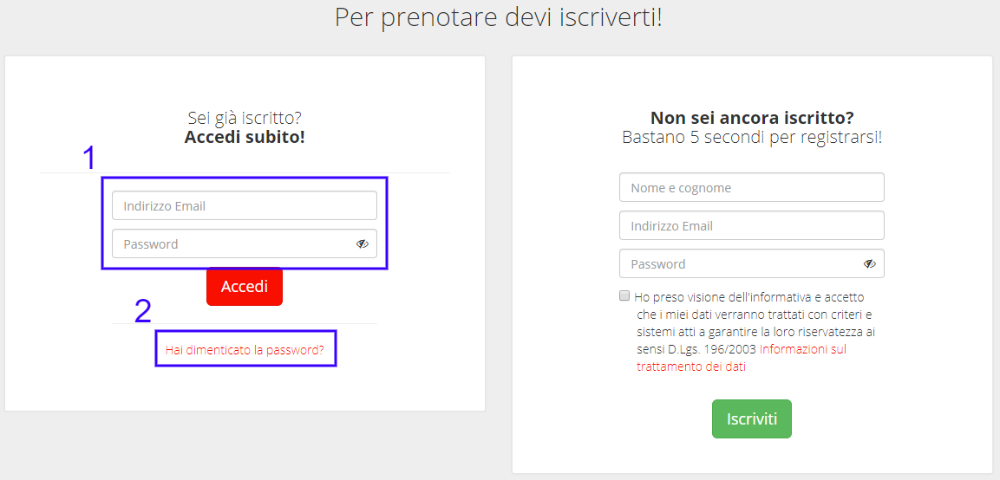

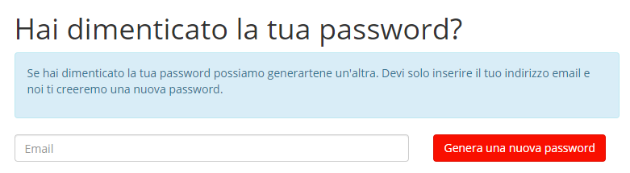

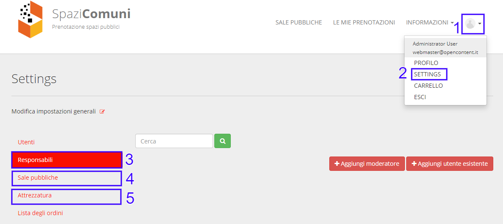

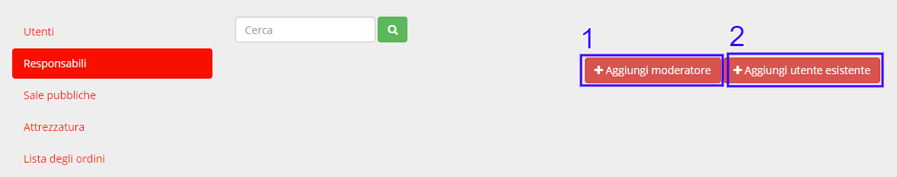

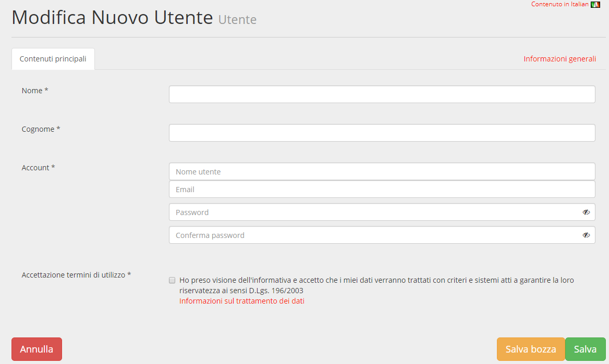

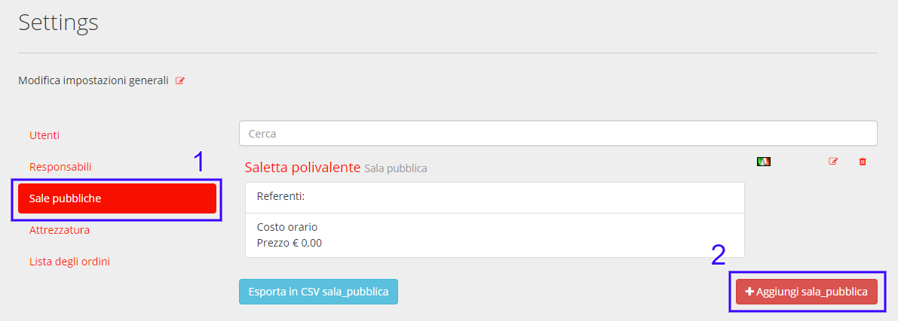

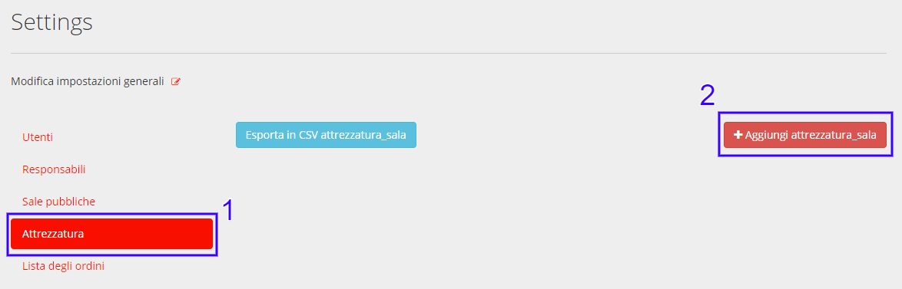

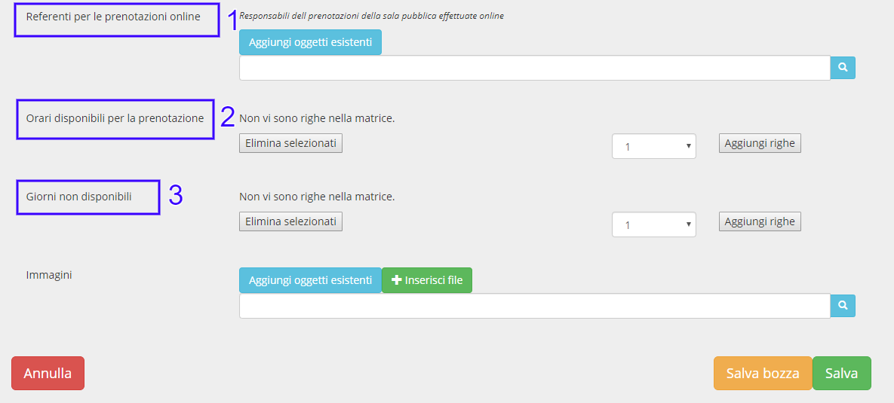

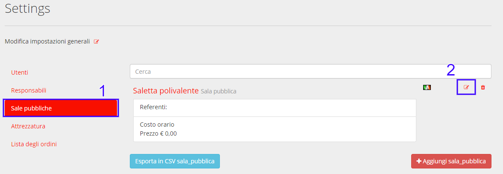

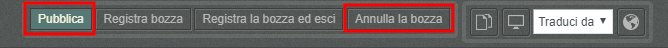

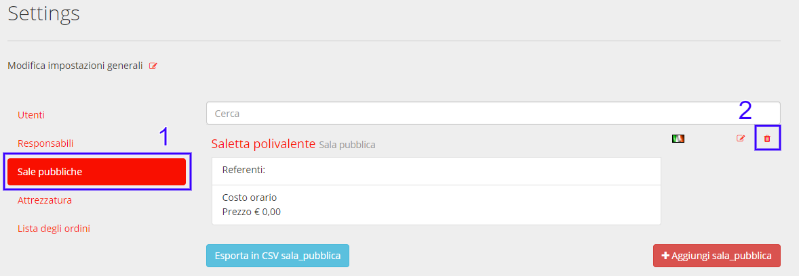
