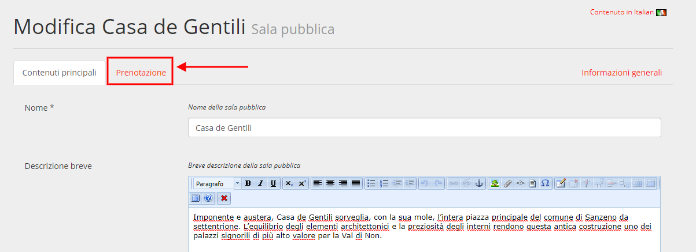

.. _h3846162056237f76803f10627221215f:

Manuale per gli operatori
*************************

Quando un amministratore inserisce le informazioni relative alle sale e attrezzature, definisce anche chi è l’operatore responsabile per ogni sala e per ogni attrezzatura. 

Ogni operatore responsabile di una sala o di un'attrezzatura viene notificato via mail quando viene prenotato un oggetto (sala o attrezzatura) di cui è responsabile. 

.. _h4415848433f221aec1a14347f613e:

Accedi al sistema
=================

Dopo aver ricevuto le credenziali di accesso al sistema come \ |STYLE0|\ , puoi accedere alla piattaforma attraverso il pulsante “Accedi”, disponibile nel menu principale. 

\ |IMG1|\ 

Al primo accesso ti verrà chiesto di creare una nuova password.

Durante i successivi accessi, inserisci le credenziali (indirizzo mail e password) da te impostate in fase di primo accesso alla piattaforma (1).

\ |IMG2|\ 

Se hai dimenticato la password puoi richiedere la generazione di una nuova password cliccando sul link “Hai dimenticato la password?” (2).

\ |IMG3|\ 

Inserisci la tua mail (la stessa utilizzata durante la fase di registrazione alla piattaforma), clicca sul pulsante “Genera una nuova password” e controlla la tua casella di posta elettronica. La tua nuova password ti è stata inviata via mail.

.. _h12462d347355d355a36655e34634877:

Gestisci il processo di prenotazione
====================================

.. _h7f6071304f5b5c423f1064171f5c7231:

Visualizza le richieste di prenotazione
---------------------------------------

* Notifica mail

Ogni volta che un utente inserisce una richiesta di prenotazione all’interno della piattaforma, l’operatore o gli operatori responsabile/i per quella sala/attrezzatura riceve/ono una notifica via mail. Per visualizzare la richiesta di prenotazione clicca sul link all’interno della mail.

Dopo aver effettuato il login al sistema potrai visionare la richiesta di prenotazione, al fine di valutarne l’idoneità, confermare la disponibilità della sala/attrezzatura oppure rifiutare la richiesta.

* Le mie prenotazioni

In ogni momento, un operatore può controllare le prenotazioni alle sale e attrezzature di cui è responsabile, e può vederne lo stato. 

Per farlo, deve effettuare l’accesso al sistema e cliccare sul pulsante “Le mie prenotazioni”, presente sul menù in alto.

\ |IMG4|\ 

\ |IMG5|\ 

Cliccando sull’id (numero identificativo) di ogni prenotazione, l’operatore finisce nella schermata di gestione della prenotazione stessa, e da lì può valutarne l’idoneità, confermare la disponibilità della sala/attrezzatura oppure rifiutare la richiesta.

.. _h4a2414785b7930434515e7b721b2765:

Conferma la prenotazione 
-------------------------

\ |IMG6|\ 

Per confermare la prenotazione clicca sul pulsante “\ |STYLE1|\ ”.

Una volta confermata la prenotazione, essa passerà dallo stato da “in attesa di approvazione” allo stato “Confermato”.

\ |IMG7|\ 

Nel caso la prenotazione prevedesse dei costi, invece, la conferma sposterà la prenotazione dallo stato “in attesa di approvazione” allo stato “in attesa di pagamento”.

\ |IMG8|\ 

In entrambi i casi, una notifica via mail verrà inviata all’utente che ha prenotato.

.. _h6e12627d781102c424d3b417f773043:

Rifiuta la richiesta di prenotazione
------------------------------------

Per rifiutare la richiesta di prenotazione clicca sul pulsante “Rifiuta la richiesta”.

\ |IMG9|\ 

.. _h2c1d74277104e41780968148427e:

.. _h2c1d74277104e41780968148427e:

.. _h753574c261c4071262b565d2216137:

Personalizza gli orari disponibili
==================================

Per personalizzare gli orari di una sala effettua i seguenti passaggi:

#. seleziona dal menu in alto a destra la voce \ |STYLE2|\ . All’interno del menù sulla sinistra seleziona la voce \ |STYLE3|\ .

#. Individua nell’elenco la sala che desideri modificare e clicca sul pulsante \ |STYLE4|\ .

\ |IMG10|\ 

#. Clicca su Prenotazione

\ |IMG11|\ 

#. Nel campo relativo Inserisci gli orari disponibili per la prenotazione

\ |IMG12|\ 

.. bottom of content

.. |STYLE0| replace:: **moderatore**

.. |STYLE1| replace:: **Conferma la disponibilità della sala**

.. |STYLE2| replace:: **Settings**

.. |STYLE3| replace:: **Sale pubbliche**

.. |STYLE4| replace:: **Modifica**

.. |IMG1| image:: static/Manuale_per_gli_operatori_1.png
   :height: 293 px
   :width: 624 px

.. |IMG2| image:: static/Manuale_per_gli_operatori_2.png
   :height: 300 px
   :width: 624 px

.. |IMG3| image:: static/Manuale_per_gli_operatori_3.png
   :height: 172 px
   :width: 624 px

