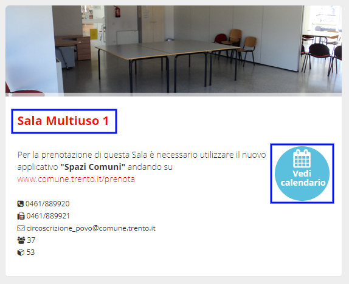
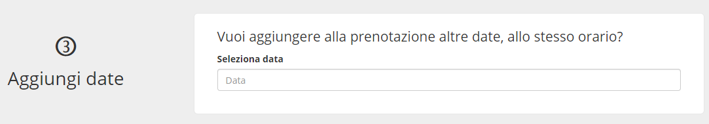

.. _h753a131d4a6c392a61f3f402f624f71:

Manuale per i cittadini
***********************

Chiunque può visualizzare la lista delle sale e delle attrezzature, e le loro caratteristiche, ma solo gli utenti registrati possono procedere alla prenotazione.

.. _h414f6d6f514fd4a5e5f354b1879205:

Visualizza le sale disponibili
==============================

Le sale pubbliche sono immediatamente visibili nella pagina principale. 

\ |IMG1|\ 

È possibile raggiungere in ogni momento l’elenco delle sale anche cliccando sulla voce relativa (“Sale pubbliche”) nel menu principale.

\ |IMG2|\ 

Le sale sono visibili in due modalità:

* \ |STYLE0|\  Le sale  vengono mostrate in una lista. 

\ |IMG3|\ 

* \ |STYLE1|\  Le sale sono rappresentate su una mappa del territorio

\ |IMG4|\ 

    \ |STYLE2|\ 

Cliccando su una singola sala/attrezzatura si accede al dettaglio, che mostra tutte le caratteristiche (dimensioni, informazioni sui costi, ...) e un calendario con le disponibilità. 

.. _h3f693013b22362c22313267b24b5d:

Filtra le sale per disponibilità e destinazione d’uso
=====================================================

Sia nel caso della visualizzazione a elenco che a mappa, è possibile filtrare le sale per \ |STYLE3|\  (data e orario di utilizzo) o per \ |STYLE4|\ .

\ |IMG5|\ 

.. _h5a3f315c66312b767162406262f5f14:

Visualizza le attrezzature disponibili
======================================

Le attrezzature sono immediatamente visibili nella pagina principale. 

\ |IMG6|\ 

È possibile raggiungere in ogni momento l’elenco delle sale anche cliccando sulla voce relativa (“Attrezzatura”) nel menu principale.

La attrezzature sono visualizzate su una \ |STYLE5|\ , con la possibilità di filtrare per disponibilità (data e orario di utilizzo).

\ |IMG7|\ 

\ |STYLE6|\ 

.. _h112c6c6d73721023293351501d7c2c15:

Registrati alla piattaforma
===========================

\ |IMG8|\ 

Per prenotare sale e attrezzature, devi essere registrato al sistema. La registrazione avviene attraverso un form di registrazione dove devi inserire il tuo nome, cognome, indirizzo email e scegliere una password.

Il sistema ti invierà una email chiedendo di cliccare su un link. 

Clicca sul link e conferma la validità dell’indirizzo email. Una volta terminato il processo di registrazione, potrai procedere alla prenotazione di sale e attrezzature.

.. _h4415848433f221aec1a14347f613e:

Accedi al sistema
=================

\ |IMG9|\ 

Il login viene effettuato dal form che si trova nella pagina principale, in basso. È sufficiente inserire il proprio username e la propria password per accedere al sistema.

Se hai dimenticato la password puoi richiedere la generazione di una nuova password cliccando sul link “Hai dimenticato la password?” (2).

\ |IMG10|\ 

Inserisci la tua mail (la stessa utilizzata durante la fase di registrazione alla piattaforma), clicca sul pulsante “Genera una nuova password” e controlla la tua casella di posta elettronica. La tua nuova password ti è stata inviata via mail.

.. _h523339387e436e5e1e3c2d4d243f4c5c:

Prenota una sala o un’attrezzatura
==================================

\ |IMG11|\ 

Dopo aver individuata la sala o l’attrezzatura di tuo interesse, clicca sul dettaglio della sala per verificare il calendario della disponibilità.

\ |IMG12|\ 

Cliccando uno dei giorni disponibili (indicati in verde sul calendario) si avvia la richiesta di prenotazione per il giorno indicato. Il sistema chiede l’inserimento dell’orario di utilizzo della sala, e poi si accede alla schermata di prenotazione.

\ |IMG13|\ 

\ |IMG14|\ 

La schermata è divisa in sezioni:

.. _h17231316d7b2776505321556349402e:

Presentazione dell’attività
~~~~~~~~~~~~~~~~~~~~~~~~~~~

\ |IMG15|\ 

Viene richiesto di specificare lo \ |STYLE7|\  del bene prenotato (ad esempio “presentazione libro”, “proiezione documentario”, e così via…)

Se è indicato un \ |STYLE8|\ , viene chiesto di scegliere quale fascia di prezzo corrisponde allo status del cittadino che sta prenotando. Inoltre, il cittadino può scegliere per quale \ |STYLE9|\  (tra quelle censite nel sistema) sta effettuando la prenotazione, e può specificare quali saranno i \ |STYLE10|\ , ovvero i soggetti che utilizzano lo spazio o l'attrezzatura.

.. _h57693c1886e5116214f1a6d87f2627:

Comunicazione e patrocinio
~~~~~~~~~~~~~~~~~~~~~~~~~~

\ |IMG16|\ 

In questa sezione, se attiva, è possibile richiedere all’ente gestore di sale e attrezzatura il patrocinio per l’evento che si sta organizzando (e per il quale si sta prenotando). Inoltre si possono richiedere (se offerti dall’ente) i servizi di comunicazione e promozione del proprio evento.

.. _h136f424913229724cd64541f17:

Aggiungi date
~~~~~~~~~~~~~

\ |IMG17|\ 

In questa sezione è possibile aggiungere date aggiuntive alla prenotazione (tenendo fisso l’orario), utile per prenotazioni di date multiple.

Una volta terminata la prenotazione, il sistema presenta un riepilogo. La prenotazione è in stato “in attesa di approvazione”. Una notifica viene inviata al responsabile della sala (o attrezzatura), il quale si occuperà di verificare i dati inseriti, valutare l’idoneità della prenotazione, e accettarla o rifiutarla. Tutti i passaggi della pratica di prenotazione (Iter della richiesta) sono visibili al cittadino, che in ogni momento può verificarne lo stato.

\ |IMG18|\ 

.. _h48137283e1077282118a163c363e3:

Verifica le tue prenotazioni
============================

In ogni momento, puoi verificare lo stato di tutte le proprie prenotazioni dalla sezione “Le mie prenotazioni” (1). Qui sono visibili tutte le prenotazioni da te effettuate, con i dettagli sulle date e sullo stato (2). Cliccando sull’id (numero identificativo) della prenotazione, puoi accedere ai dettagli della prenotazione stessa.

\ |IMG19|\ 

.. bottom of content

.. |STYLE0| replace:: **Lista.**

.. |STYLE1| replace:: **Mappa.**

.. |STYLE2| replace:: *Le sale pubbliche mostrate sulla mappa*

.. |STYLE3| replace:: **disponibilità**

.. |STYLE4| replace:: **destinazione d’uso**

.. |STYLE5| replace:: **lista**

.. |STYLE6| replace:: *Le sale pubbliche mostrate in una lista*

.. |STYLE7| replace:: **scopo dell’utilizzo**

.. |STYLE8| replace:: **costo**

.. |STYLE9| replace:: **associazione**

.. |STYLE10| replace:: **destinatari**

.. |IMG1| image:: static/Manuale_per_i_cittadini_1.png
   :height: 268 px
   :width: 498 px

.. |IMG2| image:: static/Manuale_per_i_cittadini_2.png
   :height: 90 px
   :width: 520 px

.. |IMG3| image:: static/Manuale_per_i_cittadini_3.png
   :height: 388 px
   :width: 536 px

.. |IMG4| image:: static/Manuale_per_i_cittadini_4.png
   :height: 408 px
   :width: 538 px

.. |IMG5| image:: static/Manuale_per_i_cittadini_5.png
   :height: 96 px
   :width: 624 px

.. |IMG11| image:: static/Manuale_per_i_cittadini_11.png
   :height: 468 px
   :width: 573 px

