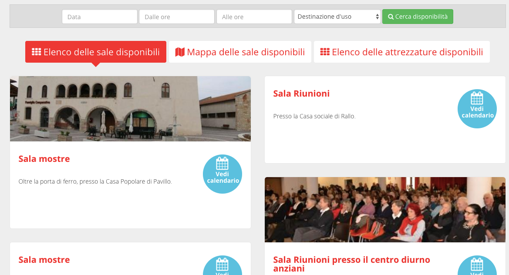
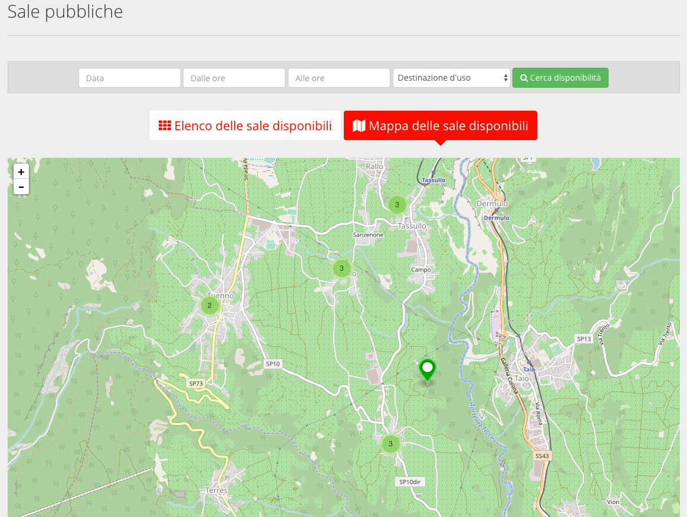

.. _h753a131d4a6c392a61f3f402f624f71:

Manuale per i cittadini
***********************

Chiunque può visualizzare la lista delle sale e delle attrezzature, e le loro caratteristiche, ma solo gli utenti registrati possono procedere alla prenotazione.

.. _h3f3343395c1963172b212b3277665b1a:

Registrazione utente
====================

Per prenotare sale e attrezzature, un utente deve essere registrato al sistema. La registrazione avviene attraverso un form di registrazione dove inserire nome, cognome, indirizzo email e scegliere una password.

Il sistema invia una email all’utente chiedendo di cliccare su un link. In questo modo l’utente può confermare la validità dell’indirizzo email. Una volta terminato il processo di registrazione, il cittadino può procedere alla prenotazione di sale e attrezzature.

.. _h67225980713336a5948137057763a52:

Login
=====

Il login viene effettuato dal form che si trova nella pagina principale, in basso. E’ sufficiente inserire il proprio username e la propria password per accedere al sistema.

.. _h2e25237b62f6f0f486f22a2177d:

Ricerca di una sala/Attrezzatura
================================

Le sale pubbliche sono immediatamente visibili nella pagina principale. E’ possibile raggiungere in ogni momento l’elenco delle sale e delle attrezzature cliccando sulle voci relative nel menù principale.

\ |IMG1|\ 

.. _h4977693649686c3bc412fa1443641b:

Elenco delle sale/attrezzature
------------------------------

L’elenco delle sale e delle attrezzature si presentano allo stesso modo: una lista di elementi con nome, immagine, e breve descrizione. In alto è presente un filtro che consente di ricercare la disponibilità di sale e attrezzature. Per le sale, è possibile filtrare anche per disponibilità d’uso.

Attraverso i pulsanti dedicati è possibile cambiare la visualizzazione tra elenco e mappa. La mappa mostra la posizione geografica di sale e attrezzature.

\ |IMG2|\ 

Cliccando su una singola sala/attrezzatura si accede al dettaglio, che mostra tutte le caratteristiche (dimensioni, informazioni sui costi, ...), a anche un calendario con le disponibilità. 

\ |IMG3|\ 

Cliccando uno dei giorni disponibili (indicati in verde sul calendario) si avvia la richiesta di prenotazione per il giorno indicato. Il sistema chiede l’inserimento dell’orario di utilizzo della sala, e poi si accede alla schermata di prenotazione.

La schermata è divisa in sezioni:

.. _h17231316d7b2776505321556349402e:

Presentazione dell’attività
~~~~~~~~~~~~~~~~~~~~~~~~~~~

Viene richiesto di specificare lo scopo dell’utilizzo del bene prenotato (ad esempio “presentazione libro”, “proiezione documentario”, e così via…)

Se è indicato un costo, viene chiesto di scegliere quale fascia di prezzo corrisponde allo status del cittadino che sta prenotando. Inoltre, il cittadino può scegliere per quale associazione (tra quelle censite nel sistema) sta effettuando la prenotazione, e può specificare quali saranno i destinatari, ovvero i soggetti che utilizzano lo spazio o l'attrezzatura.

.. _h57693c1886e5116214f1a6d87f2627:

Comunicazione e patrocinio
~~~~~~~~~~~~~~~~~~~~~~~~~~

In questa sezione, se attiva, è possibile richiedere all’ente gestore di sale e attrezzatura il patrocinio per l’evento che si sta organizzando (e per il quale si sta prenotando). Inoltre si possono richiedere (se offerti dall’ente) i servizi di comunicazione e promozione del proprio evento.

.. _h136f424913229724cd64541f17:

Aggiungi date
~~~~~~~~~~~~~

In questa sezione è possibile aggiungere date aggiuntive alla prenotazione (tenendo fisso l’orario), utile per prenotazioni di date multiple.

\ |IMG4|\ 

Una volta terminata la prenotazione, il sistema presenta un riepilogo. La prenotazione è in stato “in attesa di approvazione”. Una notifica viene inviata al responsabile della sala (o attrezzatura), il quale si occuperà di verificare i dati inseriti, valutare l’idoneità della prenotazione, e accettarla o rifiutarla. Tutti i passaggi della pratica di prenotazione (Iter della richiesta) sono visibili al cittadino, che in ogni momento può verificarne lo stato.

\ |IMG5|\ 

.. bottom of content

