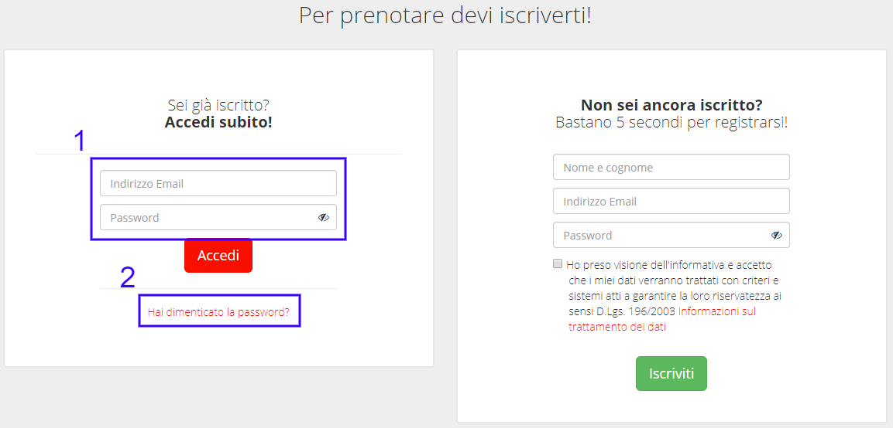

.. _h3846162056237f76803f10627221215f:

Manuale per gli operatori
*************************

Quando un amministratore inserisce le informazioni relative alle sale e attrezzature, definisce anche chi è l’operatore responsabile. L’operatore viene notificato quando viene prenotato un oggetto (sala o attrezzatura) di cui è responsabile. Da lì prosegue gestendo la pratica di prenotazione.

.. _h5548561c777f407e2957517172481a10:

Gestione del processo di prenotazione
=====================================

Un operatore viene notificato via email all’inserimento di una nuova richiesta di prenotazione. L’email contiene un link alla pratica di prenotazione. L’operatore (dopo aver effettuato il login al sistema) si trova a visionare la richiesta di prenotazione, al fine di valutarne l’idoneità e  confermare la disponibilità o rifiutare la richiesta.

\ |IMG1|\ 

Nel caso la prenotazione prevedesse dei costi, la conferma sposta la prenotazione in stato “in attesa di pagamento”, e una notifica viene inviata all’utente che ha prenotato.

.. _h5096b4e81e52225a7764e2d554027:

Le mie prenotazioni
===================

In ogni momento, un operatore può controllare le prenotazioni alle sale e attrezzature di cui è responsabile, e può vederne lo stato. 

\ |IMG2|\ 

Cliccando sull’id di ogni prenotazione, l’operatore finisce nella schermata di gestione della prenotazione stessa, e da lì può effettuare le stesse operazioni descritte nel capitolo precedente.

.. bottom of content

.. |IMG1| image:: static/Manuale_per_gli_operatori_1.png
   :height: 396 px
   :width: 624 px

